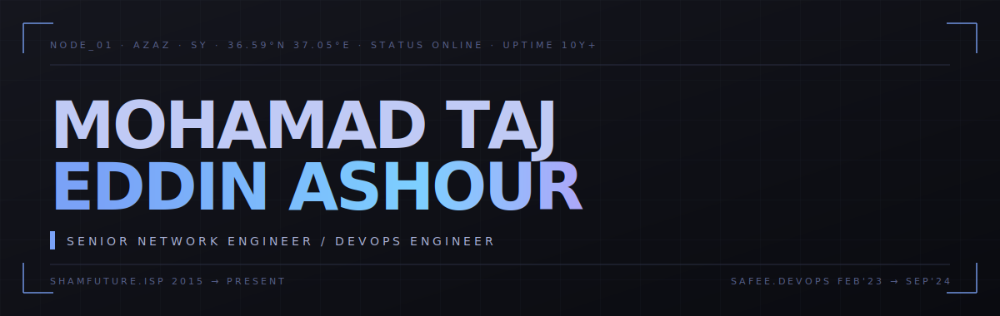
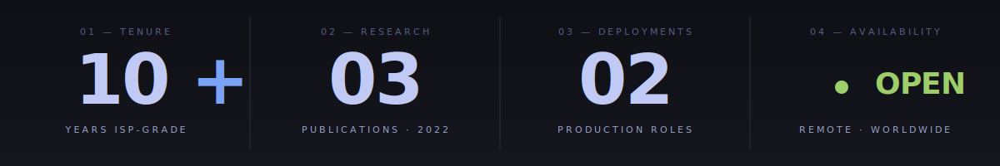

<p align="center">
  <a href="https://linkedin.com/in/taj-eddin-ashour"><code>linkedin</code></a>
  &nbsp;·&nbsp;
  <a href="https://x.com/tajeddin_ash"><code>x</code></a>
  &nbsp;·&nbsp;
  <a href="https://instagram.com/tajeddin_ash"><code>instagram</code></a>
  &nbsp;·&nbsp;
  <a href="mailto:tajeddin.eng@gmail.com"><code>mail</code></a>
</p>

<br />

```
╔═══ // 01 ─ IDENTITY ════════════════════════════════════════════════════════╗
```

<table align="center" width="100%">
<tr>
<td width="38%" valign="top">

```yaml
handle      : @mohamadtajas
located     : Aleppo · Syria
timezone    : UTC+3
languages   : ar · en · tr
education   : B.Sc. Computer Eng.
            : Hasan Kalyoncu, 2023
status      : remote-friendly
```

</td>
<td width="62%" valign="top">

> Hybrid engineer at the intersection of **carrier-grade networking** and **modern container infrastructure**. A decade spent keeping ISP backbones online, now extending the same operational discipline into Linux, Nomad clusters, and cloud platforms.

> Built for sites where the routing table and the deployment pipeline are part of the same problem.

<sub>`focus // ISP routing · wireless backhaul · Nomad+Consul · OCI · Linux ops · CI/CD · observability`</sub>

</td>
</tr>
</table>

<br />

```
╔═══ // 02 ─ METRICS ═════════════════════════════════════════════════════════╗
```



<br />

```
╔═══ // 03 ─ TELEMETRY ═══════════════════════════════════════════════════════╗
```

<p align="center">
  
</p>

<table align="center" width="100%">
<tr>
<td width="50%" align="center"></td>
<td width="50%" align="center"></td>
</tr>
<tr>
<td colspan="2" align="center"></td>
</tr>
</table>

<br />

```
╔═══ // 04 ─ STACK ═══════════════════════════════════════════════════════════╗
```

<table align="center" width="100%">
<tr>
<td width="50%" valign="top">

<sub>`╴╴╴╴╴╴ NETWORKING ╴╴╴╴╴╴`</sub>

```
mikrotik  ████████████████  expert
cisco     █████████████░░░  advanced
huawei    █████████████░░░  advanced
ubiquiti  ██████████░░░░░░  proficient
wireguard █████████████░░░  advanced
```

<sub>pppoe · vlan · qos · acl · stp/rstp · ip planning · wireless backhaul</sub>

</td>
<td width="50%" valign="top">

<sub>`╴╴╴╴╴╴ DEVOPS & INFRA ╴╴╴╴╴╴`</sub>

```
nomad     ████████████████  expert
docker    █████████████░░░  advanced
consul    █████████████░░░  advanced
nginx     █████████████░░░  advanced
k8s       ██████████░░░░░░  proficient
actions   █████████████░░░  advanced
```

<sub>ci/cd · image hardening · service discovery · linux ops</sub>

</td>
</tr>
<tr><td colspan="2"><sub>&nbsp;</sub></td></tr>
<tr>
<td width="50%" valign="top">

<sub>`╴╴╴╴╴╴ CLOUD & OBSERVABILITY ╴╴╴╴╴╴`</sub>

```
oci       ████████████████  expert
aws       ██████████░░░░░░  proficient
do        █████████████░░░  advanced
grafana   █████████████░░░  advanced
prom      █████████████░░░  advanced
otel      ██████████░░░░░░  learning
```

<sub>vpn · cost optimization · backup & ha · vulnerability lifecycle</sub>

</td>
<td width="50%" valign="top">

<sub>`╴╴╴╴╴╴ LANGUAGES & DATA ╴╴╴╴╴╴`</sub>

```
bash      ████████████████  expert
python    █████████████░░░  advanced
postgres  █████████████░░░  advanced
mysql     █████████████░░░  advanced
ts        ██████████░░░░░░  proficient
tf/sklearn██████████░░░░░░  proficient
```

<sub>automation · perf tuning · ml research (cnn / classification)</sub>

</td>
</tr>
</table>

<br />

```
╔═══ // 05 ─ DEPLOYMENTS ═════════════════════════════════════════════════════╗
```

<table align="center" width="100%">
<tr>
<td width="50%" valign="top">

<sub>`┌─ ROLE ──────────────────────────────────┐`</sub>

### Network Manager

<sub>**ShamFuture ISP** &nbsp;·&nbsp; `2015 → present` &nbsp;·&nbsp; Azaz, SY</sub>

`◍` Architect ISP-grade wired & wireless infra across multi-site deployments
`◍` Engineer **MikroTik** routing — PPPoE, traffic engineering, QoS
`◍` Deploy **Huawei / Cisco** L2/L3 with VLAN, STP/RSTP, ACL, redundancy
`◍` Plan high-capacity wireless backhaul — throughput up, latency down
`◍` Run Linux server & datacenter ops — hardening, monitoring, continuity

<sub>`└─────────────────────────────────────────┘`</sub>

</td>
<td width="50%" valign="top">

<sub>`┌─ ROLE ──────────────────────────────────┐`</sub>

### DevOps Engineer

<sub>**Safee** &nbsp;·&nbsp; `Feb 2023 → Sep 2024` &nbsp;·&nbsp; Gaziantep, TR</sub>

`◍` Built production container orchestration with **Nomad + Consul**
`◍` Automated CI/CD with **GitHub Actions** — slashed manual deploy effort
`◍` Hardened **Docker** images & managed vulnerability lifecycle
`◍` Tuned **OCI** for performance + cost · administered **PostgreSQL** HA
`◍` Authored **Bash / Python** automation · ran infra security assessments

<sub>`└─────────────────────────────────────────┘`</sub>

</td>
</tr>
</table>

<br />

```
╔═══ // 06 ─ RESEARCH ════════════════════════════════════════════════════════╗
```

<table align="center" width="100%">
<tr>
<td valign="top">

`◢` &nbsp; **Comparative Study of Deep Learning for Mask Detection**
<sub>&nbsp;&nbsp;&nbsp;&nbsp;`2022` &nbsp;·&nbsp; ICAENS 2022, Konya, Turkey</sub>

`◢` &nbsp; **CNN Hyperparameter Optimization via Random Search for Image Classification**
<sub>&nbsp;&nbsp;&nbsp;&nbsp;`2022` &nbsp;·&nbsp; 6th ISIATS — Innovative Approaches in Smart Technologies</sub>

`◢` &nbsp; **Face Mask Detection Using Deep Learning for Public Places**
<sub>&nbsp;&nbsp;&nbsp;&nbsp;`2022` &nbsp;·&nbsp; 6th ISIATS — Innovative Approaches in Smart Technologies</sub>

</td>
</tr>
</table>

<br />

```
╚═════════════════════════════════════════════════════════════════════════════╝
```

<p align="center">
  <sub>
    <code>tajeddin.eng@gmail.com</code>
    &nbsp;·&nbsp;
    <code>+3 GMT</code>
  </sub>
</p>

<p align="center">
  <sub><i>infrastructure is the backbone of everything digital.</i></sub>
</p>
